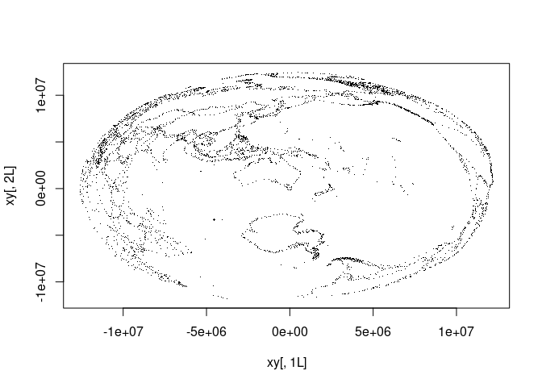
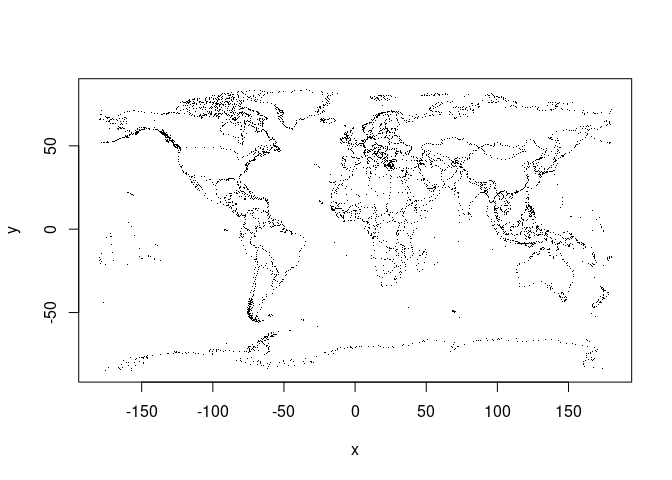
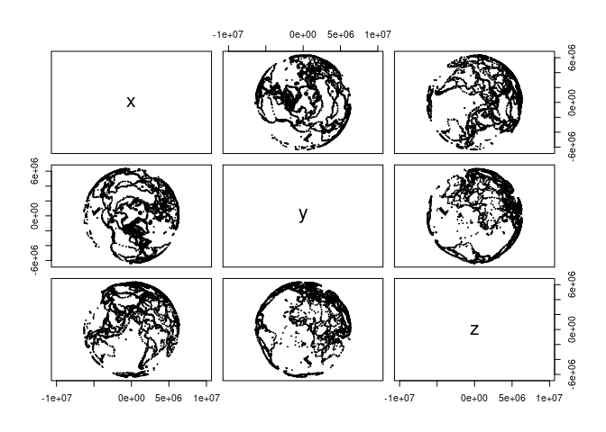

<!-- README.md is generated from README.Rmd. Please edit that file -->

<!-- badges: start -->

[](https://CRAN.R-project.org/package=PROJ)
[](https://github.com/hypertidy/PROJ/actions/workflows/R-CMD-check.yaml)
<!-- badges: end -->

# PROJ

The goal of PROJ is to provide generic coordinate system transformations
in R.

This is a shared goal with the
[reproj](https://cran.r-project.org/package=reproj) package, and PROJ
provides the infrastructure for later versions of the underlying
library.

PROJ provides basic coordinate transformations for generic numeric data
in matrices or data frames. Transforming spatial data coordinates is a
basic task independent of storage format.

PROJ is strictly for modern versions of the PROJ library.

We can use ‘auth:code’ forms, PROJ.4 strings, full WKT2, or the name of
a CRS as found in the PROJ database, e.g ‘WGS84’, ‘NAD27’, etc. Full
details are provided in the [PROJ
documentation](https://proj.org/development/reference/functions.html#c.proj_create).

## Things to be aware of

- You should know what your target projection is, and also what your
  source projection is. This is your responsibility.
- PROJ assumes longitude/latitude order always by setting the PROJ
  library context *proj_normalize_for_visualization*.

Please see [PROJ library
documentation](https://proj.org/development/quickstart.html) for details
on this.

## Installation

On all systems do

``` r
install.packages("PROJ")
```

or

``` r
remotes::install_cran("PROJ")
```

To install the development version from Github do

``` r
remotes::install_github("hypertidy/PROJ")
```

## Example

Minimal code example, two lon-lat coordinates to LAEA, and back.

``` r
library(PROJ)
lon <- c(0, 147)
lat <- c(0, -42)
dst <- "+proj=laea +datum=WGS84 +lon_0=147 +lat_0=-42"
src <- "+proj=longlat +datum=WGS84"

## forward transformation
(xy <- proj_trans( cbind(lon, lat), dst, source = src))
#>             x        y
#> [1,] -8013029 -8225762
#> [2,]        0        0

## inverse transformation
proj_trans(cbind(xy[,1L], xy[,2L]), src, source = dst)
#>                  x             y
#> [1,] -2.544444e-14  3.194835e-14
#> [2,]  1.470000e+02 -4.200000e+01


## note that NAs propagate in the usual way
lon <- c(0, NA, 147)
lat <- c(NA, 0, -42)

proj_trans(cbind(lon, lat), src, source = dst)
#>             x         y
#> [1,]      NaN       NaN
#> [2,]      NaN       NaN
#> [3,] 147.0018 -42.00038
```

A more realistic example with coastline map data.

``` r
library(PROJ)
w <- PROJ::xymap
lon <- na.omit(w[,1])
lat <- na.omit(w[,2])
dst <- "+proj=laea +datum=WGS84 +lon_0=147 +lat_0=-42"
xy <- proj_trans(cbind(lon, lat), dst, source = "EPSG:4326")
plot(xy[,1L], xy[,2L], pch = ".")
```



``` r

lonlat <- proj_trans(xy, src, source = dst)
plot(lonlat, pch = ".")
```



## Convert projection strings

We can generate PROJ or within limitations WKT2 strings, format 0, 1, 2
for WKT, proj4string, projjson respectively.

``` r
cat(wkt2 <- proj_crs_text("EPSG:4326"))
#> GEOGCRS["WGS 84",
#>     ENSEMBLE["World Geodetic System 1984 ensemble",
#>         MEMBER["World Geodetic System 1984 (Transit)"],
#>         MEMBER["World Geodetic System 1984 (G730)"],
#>         MEMBER["World Geodetic System 1984 (G873)"],
#>         MEMBER["World Geodetic System 1984 (G1150)"],
#>         MEMBER["World Geodetic System 1984 (G1674)"],
#>         MEMBER["World Geodetic System 1984 (G1762)"],
#>         MEMBER["World Geodetic System 1984 (G2139)"],
#>         MEMBER["World Geodetic System 1984 (G2296)"],
#>         ELLIPSOID["WGS 84",6378137,298.257223563,
#>             LENGTHUNIT["metre",1]],
#>         ENSEMBLEACCURACY[2.0]],
#>     PRIMEM["Greenwich",0,
#>         ANGLEUNIT["degree",0.0174532925199433]],
#>     CS[ellipsoidal,2],
#>         AXIS["geodetic latitude (Lat)",north,
#>             ORDER[1],
#>             ANGLEUNIT["degree",0.0174532925199433]],
#>         AXIS["geodetic longitude (Lon)",east,
#>             ORDER[2],
#>             ANGLEUNIT["degree",0.0174532925199433]],
#>     USAGE[
#>         SCOPE["Horizontal component of 3D system."],
#>         AREA["World."],
#>         BBOX[-90,-180,90,180]],
#>     ID["EPSG",4326]]

proj_crs_text(wkt2, format = 1L)
#> [1] "+proj=longlat +datum=WGS84 +no_defs +type=crs"
```

## Use wk for xyz and xyzt

``` r
trans <- proj_trans_create("EPSG:3857", "+proj=cart")
wmerc <- proj_trans(w, "EPSG:3857", source = "EPSG:4326")
plot(as.data.frame(wk::wk_transform(wk::xyz(wmerc[,1], wmerc[,2], 0), trans)), cex = .1, pch = 19, asp = 1)
```



------------------------------------------------------------------------

Please note that the PROJ project is released with a [Contributor Code
of
Conduct](https://github.com/hypertidy/PROJ/blob/main/CODE_OF_CONDUCT.md).
By contributing to this project, you agree to abide by its terms.
